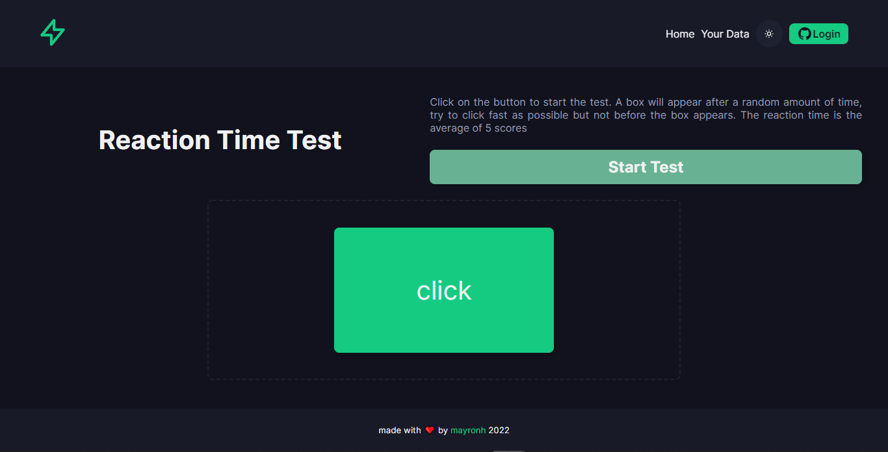
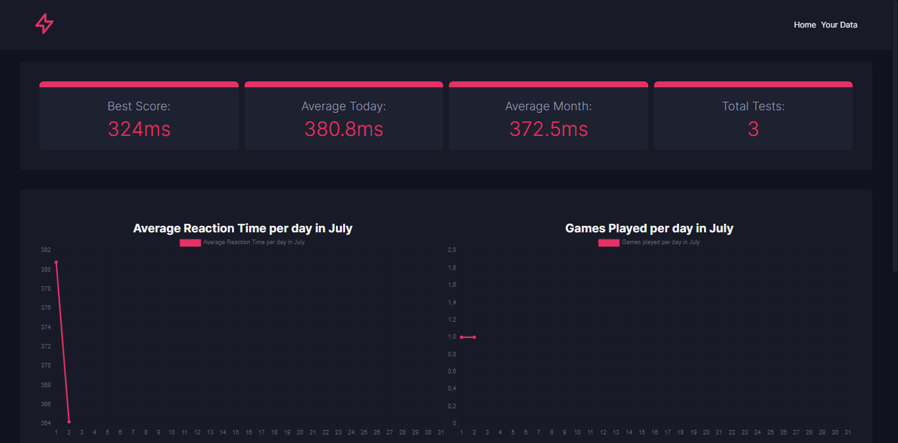

# Reaction Time Test with Vue + Firebase



A Reaction Time Test Application with [Firebase](https://firebase.google.com/) to save data and display yours statistics



## Built with

- [Typescript](https://www.typescriptlang.org/)
- [Vue](https://vuejs.org/)
- [Vite](https://vitejs.dev/)
- [pNpM](https://pnpm.io/)
- [Pinia](https://pinia.vuejs.org/)
- [Vue Router](https://router.vuejs.org/)
- [Firebase](https://firebase.google.com/)
- [Vue-ChartJs](https://vue-chartjs.org/)

## Get Started

- Get the project code

```bash
git clone https://github.com/mayronH/reaction-time-v2.git
```

- Installation of dependencies

```bash
cd reaction-time-v2

pnpm install

```

- run

```bash
pnpm dev
```

- build

```bash
pnpm build
```

## Roadmap

- [x] Add Graphs
- [x] Add Authentication with Github
- [x] Add Light/Dark Theme Switch
- [x] Add tests with Vitest
- [x] PWA
- [ ] Add More Tests and e2e with Cypress
- [ ] Daily Push Notification with PWA
